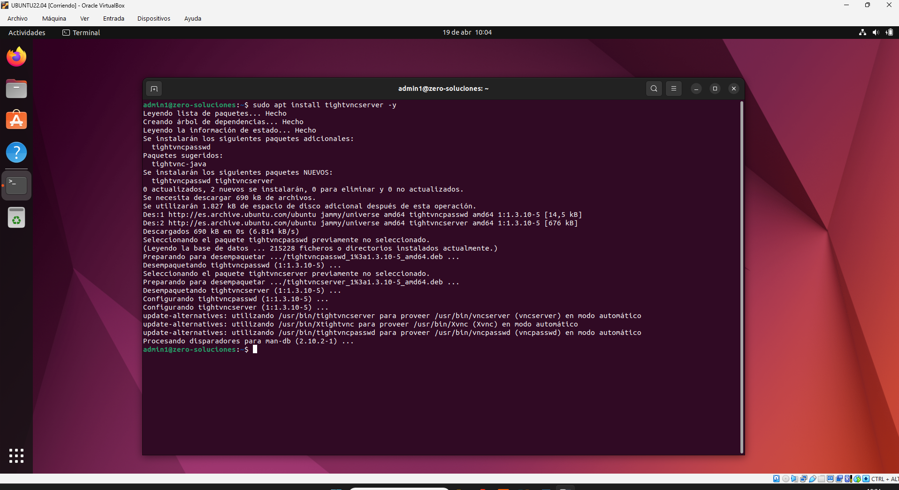

# 🚀 Acceso Remoto: Servidor Ubuntu 22.04 y Cliente Windows 10

Este manual documenta el proceso técnico integral para crear un entorno de administración remota profesional, desde la virtualización en VirtualBox hasta la validación del flujo de control gráfico mediante el protocolo VNC.

---

# 📑 Índice de Contenidos

* [🛠️ Especificaciones Técnicas](#️-especificaciones-técnicas)
* [📂 Fase 01: Preparación y Actualización del Servidor](#-fase-01-preparación-del-sistema-e-instalación-de-entorno-gráfico)
* [📂 Fase 02: Instalación de TightVNC Server](#-fase-02-instalación-de-tightvnc-server)
* [📂 Fase 04: Configuración del Script de Inicio (xstartup)](#-fase-05-configuración-del-script-de-inicio-xstartup)
* [📂 Fase 05: Gestión de Seguridad y Firewall (UFW)](#-fase-06-gestión-de-seguridad-y-firewall-ufw)
* [📂 Fase 06: Instalación del Cliente en Windows 10](#-fase-07-instalación-del-cliente-en-windows-10)
* [📂 Fase 08: Verificación y Pruebas de Conectividad](#-fase-08-verificación-y-pruebas-de-conectividad)
* [🏆 Conclusión Final](#-conclusión-final)
* [🧠 Lecciones Aprendidas (Troubleshooting)](#-lecciones-aprendidas-troubleshooting)
* [🚀 Hoja de Ruta (Próximos Pasos)](#-hoja-de-ruta-próximos-pasos)

---

## 🛠️ Especificaciones Técnicas
Para asegurar la replicabilidad de este laboratorio, se detallan los recursos de hardware virtual y software utilizados:

### 3.1: Nodo Servidor (Ubuntu 22.04)
* **Sistema Operativo:** Ubuntu 22.04 LTS (Jammy Jellyfish).
* **Entorno Gráfico:** XFCE4 (Optimizado para VNC).
* **Recursos VM:** 4GB RAM | 2 vCPUs | 25GB VDI.
* **Red:** Adaptador Puente (Bridge).

### 3.2: Nodo Cliente (Windows 10)
* **Sistema Operativo:** Windows 10 Pro.
* **Recursos VM:** 8GB RAM | 2 vCPUs | 50GB VDI.
* **Software:** TightVNC Viewer.

---

## 📂 Fase 01: Preparación del Sistema e Instalación de Entorno Gráfico
En esta etapa se garantiza que el servidor cuente con las últimas definiciones de seguridad y se procede a la instalación de una interfaz gráfica ligera para optimizar la transmisión de datos.

### 1.1. Actualización de Repositorios
Se garantiza que el sistema disponga de las últimas firmas de seguridad y versiones de software:
`sudo apt update && sudo apt upgrade -y`

### 1.2. Instalación del Entorno XFCE4
Para maximizar el rendimiento del acceso remoto, se instala el escritorio ligero **XFCE4** y sus complementos, evitando la carga excesiva que supone el entorno GNOME por defecto:
`sudo apt install xfce4 xfce4-goodies -y`

---

## 📂 Fase 02: Instalación de TightVNC Server
Con el entorno gráfico ligero ya configurado, el siguiente paso es la instalación del software de servidor. **TightVNC** es el estándar elegido para este despliegue debido a su alta eficiencia en el manejo de recursos y compatibilidad con múltiples clientes.

### 2.1. Despliegue del Binario
Se utiliza el gestor de paquetes de Ubuntu para descargar e integrar los binarios necesarios del servidor VNC. Este paquete habilita al servidor para escuchar peticiones remotas en el puerto 5901 (por defecto):

`sudo apt install tightvncserver -y`

---

## 🏆 Conclusión Final
El proyecto ha demostrado la viabilidad de implementar un sistema de control remoto gráfico multiplataforma. Se ha logrado integrar con éxito un servidor Linux accesible desde clientes Windows, optimizando recursos mediante el uso de entornos ligeros y configuraciones de red locales.

## 🧠 Lecciones Aprendidas (Troubleshooting)
* **Configuración de Red:** El uso de modo NAT impide la conexión directa sin reenvío de puertos; el Adaptador Puente es crítico para visibilidad LAN directa.
* **Pantalla Gris en VNC:** Error común si el archivo `xstartup` no tiene permisos de ejecución o no apunta al escritorio correcto.
* **Firewall:** Es obligatorio abrir el puerto 5901 (o el correspondiente al display :1) para evitar bloqueos de conexión.

## 🚀 Hoja de Ruta (Próximos Pasos)
1. **Túnel SSH:** Implementar seguridad mediante SSH para cifrar el tráfico VNC, que por defecto viaja en plano.
2. **Persistencia:** Configurar el servidor VNC como un servicio de `systemd` para que arranque automáticamente con el sistema.

---

