# 🚀 Acceso Remoto: Servidor Ubuntu 22.04 y Cliente Windows 10

Este manual documenta el proceso técnico integral para crear un entorno de administración remota profesional, desde la virtualización en VirtualBox hasta la validación del flujo de control gráfico mediante el protocolo VNC.

---

# 📑 Índice de Contenidos

* [🛠️ Especificaciones Técnicas](#️-especificaciones-técnicas)
* [📂 Fase 01: Preparación y Actualización del Servidor](#-fase-01-preparación-del-sistema-e-instalación-de-entorno-gráfico)
* [📂 Fase 02: Configuración Inicial Contraseña](#-fase-02-configuración-inicial-contraseña)
* [📂 Fase 03: Configuración del Arranque del Escritorio)](#-fase-03-configuración-del-arranque-del-escritorio)
* [📂 Fase 04: Creación de Túnel SSH](#-fase-04-creación-de-túnel-ssh)
* [📂 Fase 05: Implementación de RealVNC Viewer en Windows](#-fase-05-implementación-de-realvnc-viewer-en-windows)
* [📂 Fase 06: Instalación del Cliente en Windows 10](#-fase-07-instalación-del-cliente-en-windows-10)
* [📂 Fase 08: Verificación y Pruebas de Conectividad](#-fase-08-verificación-y-pruebas-de-conectividad)
* [🏆 Conclusión Final](#-conclusión-final)
* [🧠 Lecciones Aprendidas (Troubleshooting)](#-lecciones-aprendidas-troubleshooting)
* [🚀 Hoja de Ruta (Próximos Pasos)](#-hoja-de-ruta-próximos-pasos)

---

## 🛠️ Especificaciones Técnicas
Para asegurar la replicabilidad de este laboratorio, se detallan los recursos de hardware virtual y software utilizados:

### Nodo Servidor (Ubuntu 22.04)
* **Sistema Operativo:** Ubuntu 22.04 LTS (Jammy Jellyfish).
* **Entorno Gráfico:** XFCE4 (Optimizado para VNC).
* **Recursos VM:** 4GB RAM | 2 vCPUs | 50GB VDI.
* **Red:** Adaptador Puente (Bridge).

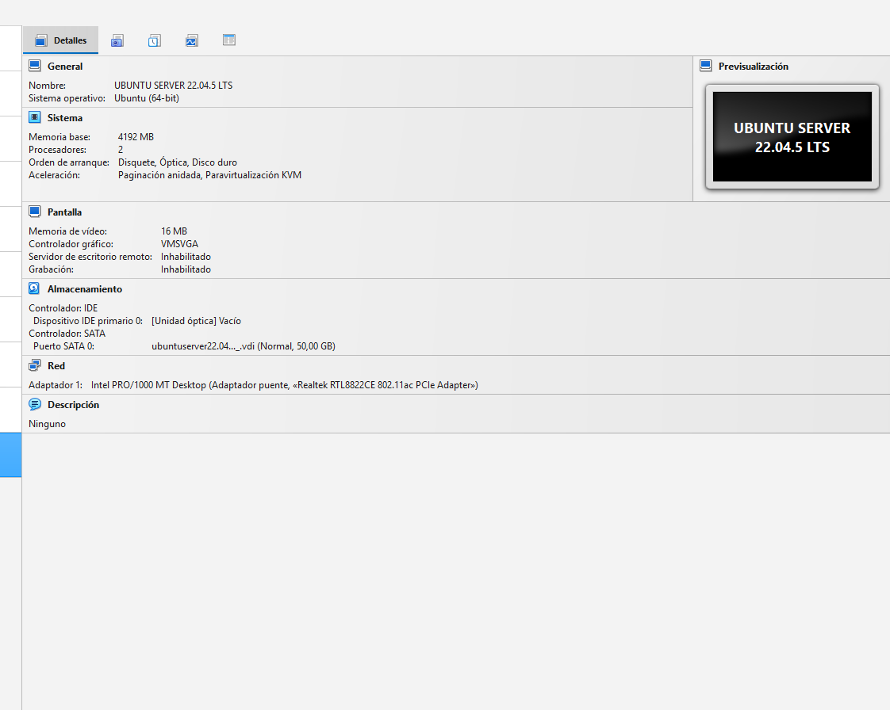

### Nodo Cliente (Windows 10)
* **Sistema Operativo:** Windows 10 Pro.
* **Recursos VM:** 8GB RAM | 2 vCPUs | 50GB VDI.
* **Software:** TightVNC Viewer.

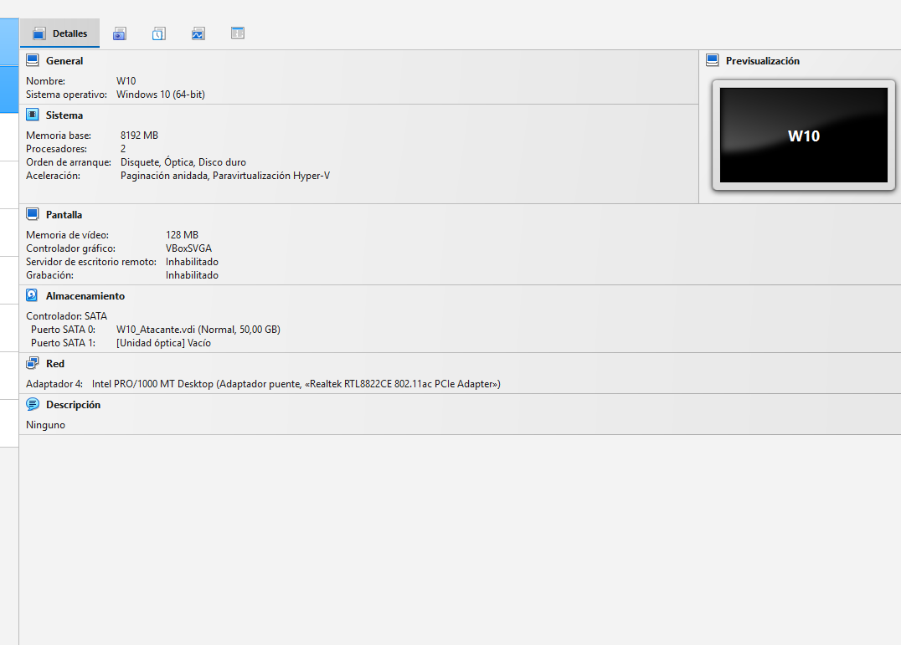

---

## 📂 Fase 01: Preparación del Sistema e Instalación de Entorno Gráfico
En esta etapa se garantiza que el servidor cuente con las últimas definiciones de seguridad y se procede a la instalación de una interfaz gráfica ligera para optimizar la transmisión de datos.

### 1.1. Actualización de Repositorios
Se garantiza que el sistema disponga de las últimas firmas de seguridad y versiones de software:
`sudo apt update -y`

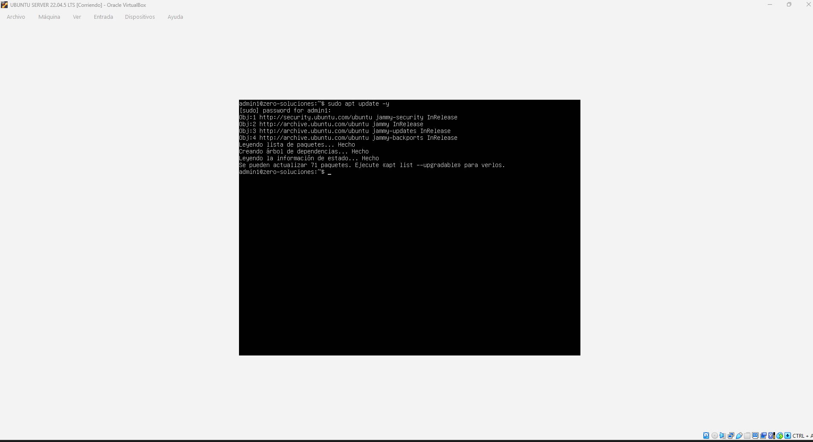

### 1.2. Instalación del Entorno XFCE4 y Servicios de Acceso Remoto
Una vez instalados los servicios, se procede a la creación de las credenciales de acceso para el servidor gráfico. Mediante el comando vncpasswd se establece una contraseña de control total y, opcionalmente, una de solo lectura (view-only), garantizando que solo los usuarios autorizados puedan gestionar el escritorio remoto:
`vncpasswd`

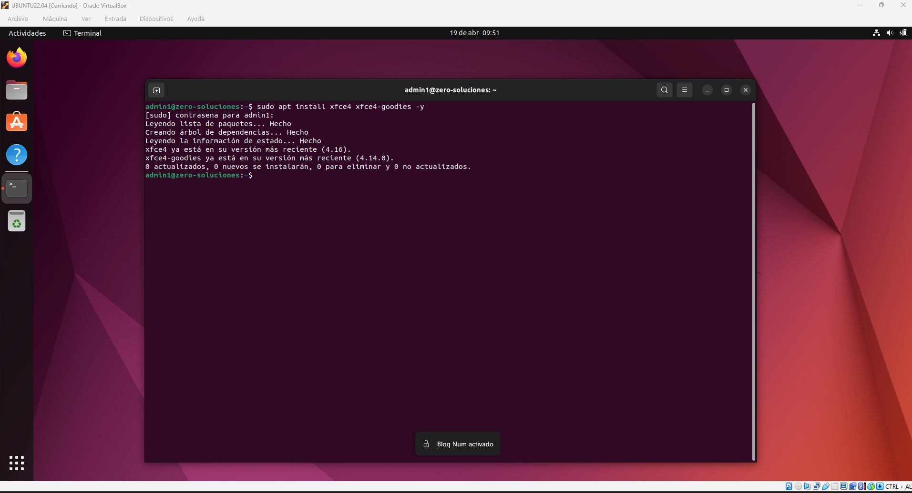

---

## 📂 Fase 02: Configuración Inicial Contraseña
Con el entorno gráfico ligero ya configurado, el siguiente paso es la instalación del software de servidor. **TigerVNC** es el estándar elegido para este despliegue debido a su alta eficiencia en el manejo de recursos y compatibilidad con múltiples clientes.

### Paso 2.1: Configuración de la Contraseña
Una vez instalados los servicios, se procede a la creación de las credenciales de acceso para el servidor gráfico mediante el comando `vncpasswd`.
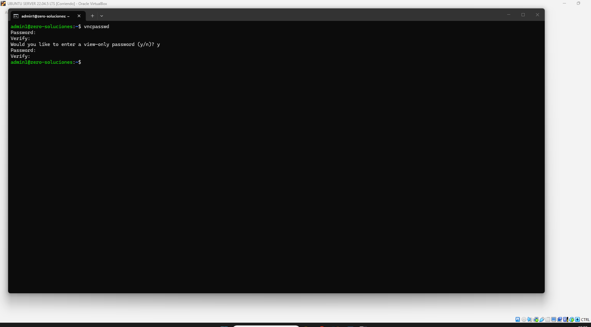

### Paso 2.2: Detalles Técnicos del Despliegue
- **Ejecución del comando:** Se utiliza `vncpasswd` para generar el archivo de claves cifradas en el directorio del usuario.
- **Password / Verify:** Definición de la clave de acceso principal para el usuario `admin1`.
- **View-only password:** Configuración de un acceso restringido (marcado como "y" en la captura) para supervisión sin capacidad de interacción.
- **Directorio de sistema:** Generación automática de la carpeta oculta `~/.vnc` donde se alojará el archivo de configuración de la sesión.

---

# 📂 Fase 03: Configuración del arranque del escritorio

Para que el servidor VNC arranque el entorno ligero **XFCE4** en lugar de una terminal vacía, es necesario editar el script de inicio del usuario, otorgarle permisos de ejecución y reiniciar el servicio para aplicar los cambios.

### Paso 3.1: Inicio del proceso de configuración
Se prepara el entorno para la modificación de los archivos de arranque del servidor.
`nano ~/.vnc/xstartup`
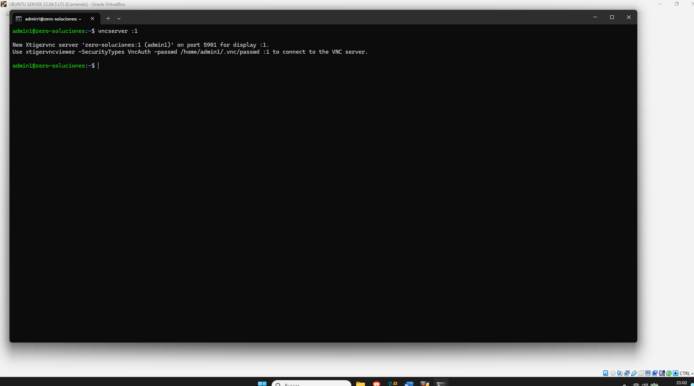

### Paso 3.2: Finalización de la sesión previa
Antes de editar el fichero de configuración, se debe matar cualquier instancia activa del servidor para evitar conflictos con archivos de bloqueo y asegurar una edición limpia.
`vncserver -kill :1`

### Paso 3.3: Edición del fichero xstartup
Se accede al archivo de configuración `xstartup` alojado en la carpeta oculta `.vnc` utilizando el editor de texto.
`nano ~/.vnc/xstartup`
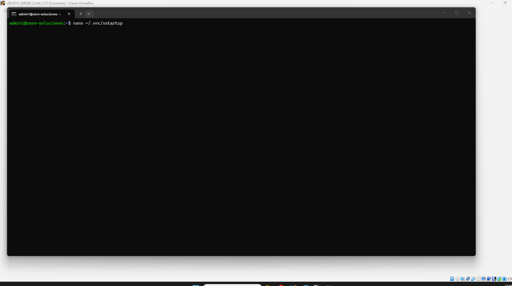

### Paso 3.4: Configuración interna del script
Se definen las variables de entorno necesarias y se especifica la ruta del ejecutable de XFCE4 para garantizar que la interfaz gráfica cargue correctamente al conectar.
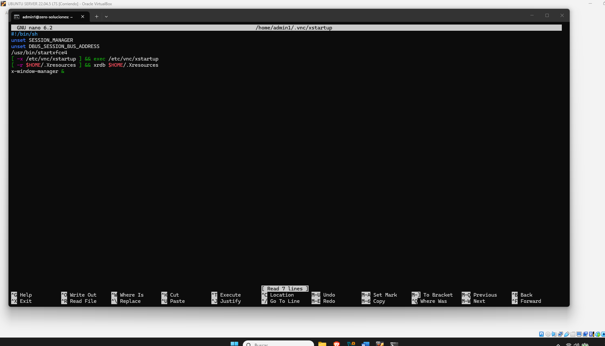

### Paso 3.5: Asignación de permisos de ejecución
Es un paso crítico transformar el script en un archivo ejecutable mediante el comando `chmod +x` para que el servidor pueda procesar las instrucciones de inicio.
`chmod +x ~/.vnc/xstartup`

### Paso 3.6: Arranque y validación del servicio
Se inicia nuevamente el servidor VNC. El sistema confirma que el servicio está corriendo en el puerto `5901` (Display `:1`), validando que la nueva configuración es operativa.
`vncserver :1`
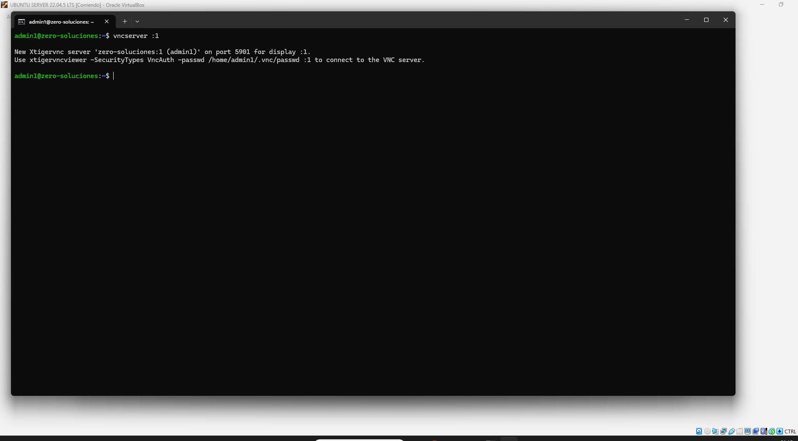

---

# 📂 Fase 04: Creación de Túnel SSH

Para garantizar que la conexión sea segura y cifrada, se utiliza un túnel SSH. Esto permite encapsular el tráfico del escritorio remoto dentro de una conexión protegida, mapeando un puerto local de nuestra máquina Windows con el puerto del servidor.

### Paso 4.1: Apertura de la terminal en el cliente
El primer paso es abrir el **Símbolo del sistema (CMD)** o PowerShell en Windows para ejecutar los comandos de red necesarios.
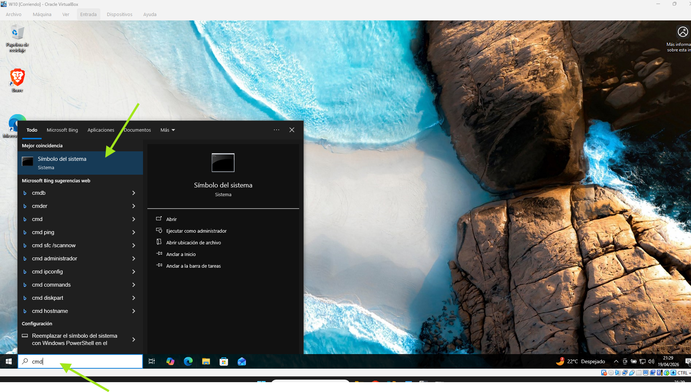

### Paso 4.2: Ejecución del túnel SSH y validación
Se ejecuta el comando para crear el túnel cifrado. En este caso, mapeamos el puerto local `59000` del cliente hacia el puerto `5901` del servidor. 

`ssh -L 59000:localhost:5901 -C -N -l admin1 192.168.1.XXX`

**Detalles técnicos del comando:**
- `-L 59000:localhost:5901`: Redirige el tráfico del puerto local 59000 al 5901 remoto.
- `-C`: Activa la compresión de datos para mejorar la fluidez de la imagen.
- `-N`: Indica que solo se requiere el túnel (no se abrirá una consola remota interactiva).
- `-l admin1`: Especifica el usuario de acceso en el servidor.

---
# 📂 Fase 05: Implementación de RealVNC Viewer en Windows

Para poder visualizar el escritorio remoto del servidor, instalaremos y configuraremos el cliente oficial **RealVNC Viewer** en la máquina Windows 10. Este software permitirá la conexión gráfica a través del túnel seguro creado anteriormente.

### Paso 5.1: Descarga del software
Se accede al portal oficial de descargas para obtener el instalador ejecutable de VNC Viewer compatible con la arquitectura de Windows 10.
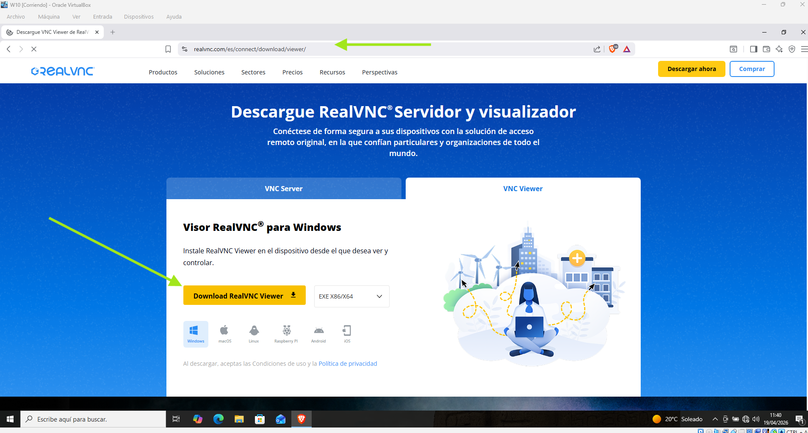

### Paso 5.2: Selección del idioma
Al ejecutar el archivo `.exe`, el asistente solicita la selección del idioma para el proceso de instalación.
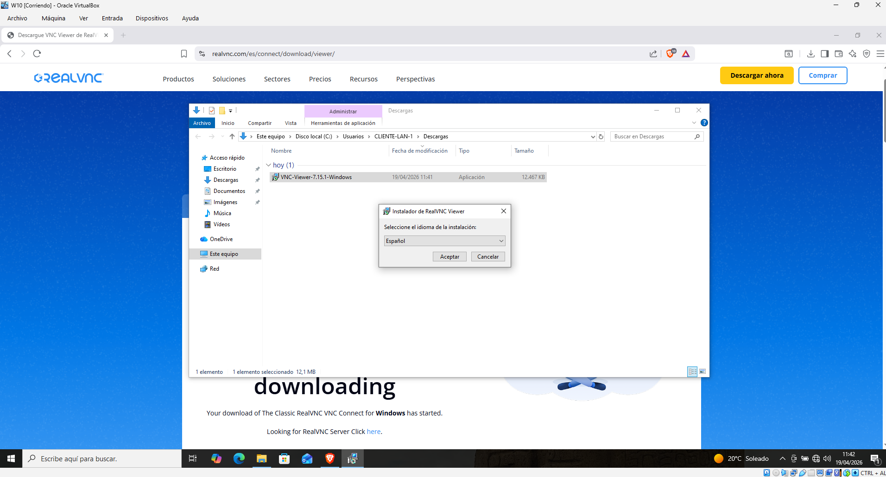

### Paso 5.3: Asistente de instalación
Inicio de la ventana de bienvenida del instalador de RealVNC, que prepara los componentes necesarios para el sistema.
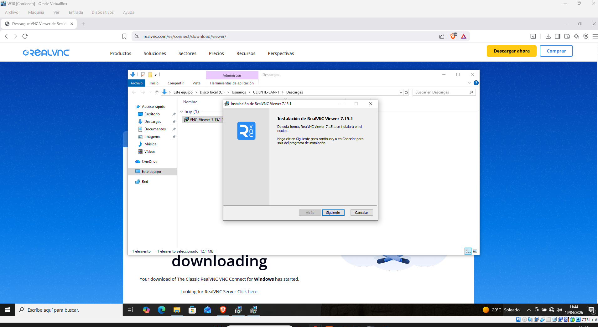

### Paso 5.4: Aceptación de términos y licencia
Lectura y validación del acuerdo de licencia de usuario final (EULA), requisito obligatorio para proceder con el despliegue.
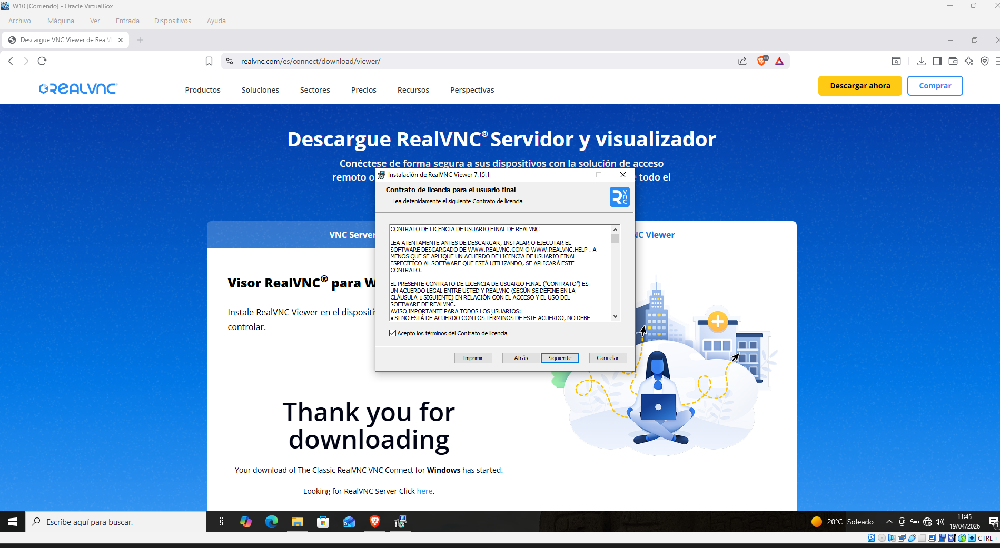

### Paso 5.5: Configuración de ruta y características
Se define el directorio de destino en el disco local y se configuran los accesos directos del programa.
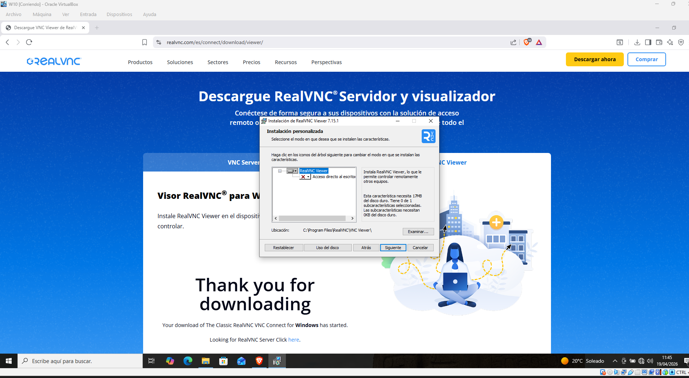

### Paso 5.6: Confirmación de inicio de instalación
Resumen de la configuración seleccionada y comienzo de la copia de archivos binarios al sistema operativo.
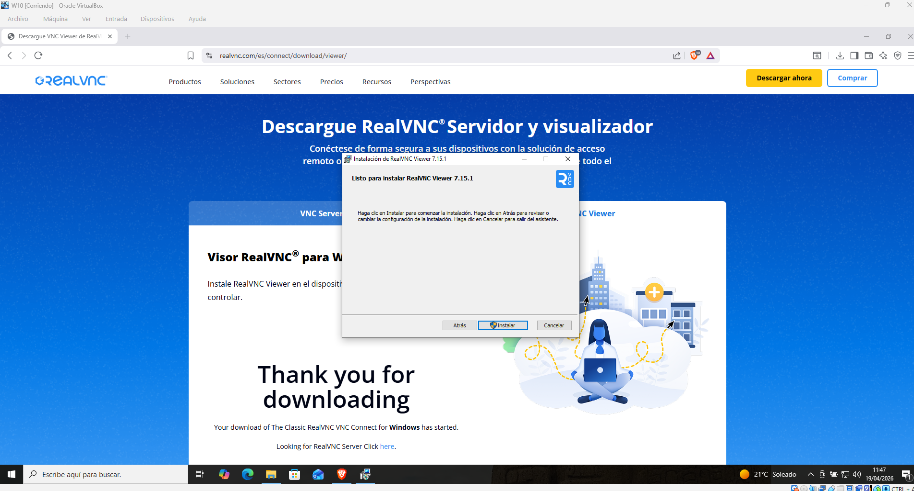

### Paso 5.7: Instalación finalizada con éxito
El proceso concluye correctamente. El cliente RealVNC Viewer ya está disponible para su ejecución en el menú de aplicaciones.
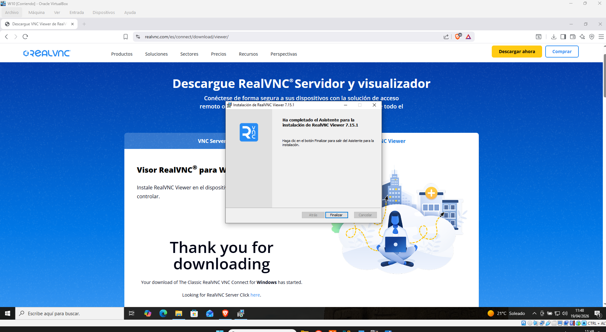

---

## 🏆 Conclusión Final
El proyecto ha demostrado la viabilidad de implementar un sistema de control remoto gráfico multiplataforma. Se ha logrado integrar con éxito un servidor Linux accesible desde clientes Windows, optimizando recursos mediante el uso de entornos ligeros y configuraciones de red locales.

## 🧠 Lecciones Aprendidas (Troubleshooting)
* **Configuración de Red:** El uso de modo NAT impide la conexión directa sin reenvío de puertos; el Adaptador Puente es crítico para visibilidad LAN directa.
* **Pantalla Gris en VNC:** Error común si el archivo `xstartup` no tiene permisos de ejecución o no apunta al escritorio correcto.
* **Firewall:** Es obligatorio abrir el puerto 5901 (o el correspondiente al display :1) para evitar bloqueos de conexión.

## 🚀 Hoja de Ruta (Próximos Pasos)
1. **Túnel SSH:** Implementar seguridad mediante SSH para cifrar el tráfico VNC, que por defecto viaja en plano.
2. **Persistencia:** Configurar el servidor VNC como un servicio de `systemd` para que arranque automáticamente con el sistema.

---

